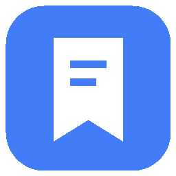

<a id="readme-top"></a>

<div align="center">
  <a href="https://github.com/tonghzhang/ContextDock">
    
  </a>

  <h1>ContextDock</h1>

  <p><strong>Save your workspace. Resume it in one click.</strong></p>
  <p>A Windows desktop app for reopening your apps, files, folders, and websites together.</p>

  <p>
    <a href="https://github.com/tonghzhang/ContextDock/releases/latest"><strong>Download for Windows</strong></a>
    ·
    <a href="#getting-started">Getting Started</a>
    ·
    <a href="https://github.com/tonghzhang/ContextDock/issues/new">Report a Bug</a>
    ·
    <a href="https://github.com/tonghzhang/ContextDock/issues/new">Request a Feature</a>
  </p>

  <p>
    <a href="https://github.com/tonghzhang/ContextDock/actions/workflows/ci.yml"></a>
    <a href="https://github.com/tonghzhang/ContextDock/releases/latest"></a>
    <a href="#prerequisites"></a>
    <a href="LICENSE"></a>
  </p>
</div>

<details>
  <summary>Table of Contents</summary>
  <ol>
    <li><a href="#about-the-project">About the Project</a></li>
    <li><a href="#getting-started">Getting Started</a></li>
    <li><a href="#usage">Usage</a></li>
    <li><a href="#development">Development</a></li>
    <li><a href="#project-structure">Project Structure</a></li>
    <li><a href="#roadmap">Roadmap</a></li>
    <li><a href="#contributing">Contributing</a></li>
    <li><a href="#license">License</a></li>
    <li><a href="#contact">Contact</a></li>
    <li><a href="#acknowledgments">Acknowledgments</a></li>
  </ol>
</details>

## About the Project

[](docs/screenshots/workspace.png)

ContextDock saves the resources you need for a task as a workspace. Add your editor,
project folder, reference documents, and browser tabs once, then search for that
workspace and press **Resume** to open them again.

Workspaces live in a local SQLite database shared by the desktop app, CLI, and MCP
server. You can also carry a workspace to another computer using a single
`.contextdock` file, with optional storage in your own private GitHub repository.

### Features

- **Workspace management** — create, edit, duplicate, and search workspaces.
- **One-click Resume** — launch enabled resources in order, with individual success and failure results.
- **Native file pickers** — select applications, files, and folders; supply application arguments when needed.
- **Keyboard shortcuts** — open ContextDock globally and search workspaces with **Ctrl+K**.
- **Portable workspaces** — export configuration and selected files, import a package, and locate missing paths.
- **Optional GitHub storage** — manually upload and download packages from a private repository.
- **Three interface languages** — English, Simplified Chinese, and Japanese.
- **CLI and MCP** — manage and open the same workspaces from your terminal or MCP client.

### Built With

[Electron](https://www.electronjs.org/) · [React](https://react.dev/) ·
[TypeScript](https://www.typescriptlang.org/) · [Vite](https://vite.dev/) ·
[SQLite](https://www.sqlite.org/) · [Lucide](https://lucide.dev/)

## Getting Started

### Prerequisites

- **To use the desktop app:** Windows 10 or 11, x64.
- **To develop or run from source:** Windows, Node.js **24 or newer**, npm, and Git.

### Installation

Download a build from [GitHub Releases][releases-url]:

| Build                                | Use                                                       |
| ------------------------------------ | --------------------------------------------------------- |
| `ContextDock-Setup-0.2.0-x64.exe`    | Install the desktop app, shortcuts, and CLI/MCP wrappers. |
| `ContextDock-Portable-0.2.0-x64.exe` | Run the desktop app without installation.                 |

Both builds include their runtime; a separate Node.js installation is not required.
The portable build saves data in the same local data directory as the installed app.

> [!NOTE]
> The v0.2.0 downloads include language switching. Workspace import/export and
> GitHub storage are currently available in the source build below.

The Windows builds are unsigned and may display an unknown-publisher warning.

### Run from Source

```powershell
git clone https://github.com/tonghzhang/ContextDock.git
cd ContextDock
npm ci
npm run dev
```

For a production build:

```powershell
npm run build
npm start
```

## Usage

1. Create a workspace, such as **ModelMux**.
2. Select **Add Item** and add an application, file, folder, or URL.
3. Arrange the launch order and disable anything you do not need.
4. Click **Resume Workspace**, or press **Ctrl+K**, search, and press **Enter**.

URLs use your default browser, files use their associated applications, and folders
open in Explorer. A failed item does not stop the remaining items.

| Shortcut                | Action                                                             |
| ----------------------- | ------------------------------------------------------------------ |
| `Ctrl+Alt+Space`        | Show ContextDock; falls back to `Ctrl+Shift+Space` if unavailable. |
| `Ctrl+K`                | Focus workspace search.                                            |
| `↑` / `↓`, then `Enter` | Select and resume a search result.                                 |

Closing the window keeps the app in the system tray. Use **Quit ContextDock** to exit.

### Languages

Choose **Settings → Language → English / 简体中文 / 日本語**.
Your selection is saved for the next launch.

Screenshots: [English](docs/screenshots/workspace.png) ·
[简体中文](docs/screenshots/workspace-zh-CN.png) · [日本語](docs/screenshots/workspace-ja.png)

### Import and Export

Choose **Export** in a workspace to save one `.contextdock` package, optionally
including selected files. On another computer, choose **Import**, review the items,
and locate missing paths. Unresolved items stay disabled until you locate them.

For GitHub transfers, configure **Settings → GitHub Connection** with a private
repository and a fine-grained personal access token. Transfers are manual.
See the [import/export guide](docs/transfer.md) for setup and package limits.

### CLI

After building from source:

```powershell
npm run cli -- create "ModelMux"
npm run cli -- add-url "ModelMux" "https://redis.io"
npm run cli -- list
npm run cli -- show "ModelMux"
npm run cli -- open "ModelMux"
```

The installed app includes `contextdock.cmd`; run it from the installation directory
or add that directory to your `PATH`. See the [CLI reference](docs/cli.md).

### MCP

Build the project, then add this local stdio server to your MCP client.
Replace the example path with your checkout's absolute path.

```json
{
  "mcpServers": {
    "contextdock": {
      "command": "node",
      "args": ["C:/Projects/ContextDock/dist/mcp.cjs"]
    }
  }
}
```

Available tools: `list_workspaces`, `get_workspace`, `open_workspace`,
`create_workspace`, `add_workspace_item`, and `remove_workspace_item`.

See the [MCP guide](docs/mcp.md) for tool arguments and installed-app configuration.

### Local Data

Workspace data is stored in `%LOCALAPPDATA%\ContextDock\contextdock.sqlite`.
The desktop, CLI, and MCP server use the same database. Set `CONTEXTDOCK_DATA_DIR`
to an absolute directory to use a separate profile.

To back up your data, stop ContextDock and its CLI/MCP processes, then copy the
entire data directory. Removing a bookmark does not delete its referenced files.

## Development

```powershell
npm ci
npm run dev
```

The renderer supports live updates. Restart the development process after changing
the Electron main process, preload, or core service.

| Command                      | Purpose                                                                           |
| ---------------------------- | --------------------------------------------------------------------------------- |
| `npm run verify`             | Run lint, formatting checks, type checking, unit tests, and the production build. |
| `npm run format`             | Format the codebase.                                                              |
| `npm run test:e2e`           | Test desktop workflows and shared CLI/MCP data.                                   |
| `npm run test:e2e:languages` | Test language switching and persistence.                                          |
| `npm run test:e2e:transfer`  | Test workspace export, import, relocation, and Resume.                            |
| `npm run test:e2e:token`     | Test the native password dialog with a fake token.                                |

Run desktop tests after `npm run build` on an interactive Windows desktop.
Tests use isolated profiles under `work/`.

### Build

```powershell
npm run dist
```

Run on Windows to generate an x64 installer and portable executable in `release/`.
The production desktop, CLI, and MCP bundles are generated in `dist/`.

## Project Structure

```text
src/
├── core/        Workspace service, SQLite migrations, validation, and launcher
├── desktop/     Electron main process, native dialogs, credentials, and IPC
├── renderer/    React interface
├── transfer/    Shared package format and local/GitHub import-export
├── cli/         Command-line interface
├── mcp/         Local MCP server
└── shared/      Shared types and translations
tests/           Unit and integration tests
scripts/         Development, build, and desktop test scripts
docs/            Usage guides and screenshots
resources/       Icons and Windows command wrappers
```

Desktop, CLI, and MCP call the same Workspace Service. Import/export uses one
transfer service for local files and GitHub packages.

## Roadmap

- [ ] Capture Current Workspace
- [ ] Browser Extension
- [ ] Window Layout Restore
- [ ] Workspace Version History
- [ ] Agent Integration
- [ ] Cross-device Sync

These are future directions. Current cross-device transfer is manual import/export.

## Contributing

Bug reports, documentation fixes, and focused pull requests are welcome.

1. [Open an issue][issues-url] to discuss a bug or proposed change.
2. Fork the repository and create a branch for your changes.
3. Add relevant tests and run `npm run verify`.
4. Open a pull request describing the change and how you tested it.

For interface changes, include screenshots and update English, Chinese, and Japanese
translations together.

## License

Licensed under the **MIT License**. See [LICENSE](LICENSE).

## Contact

Maintainer: [@tonghzhang](https://github.com/tonghzhang)

Questions and bug reports: [GitHub Issues][issues-url]

## Acknowledgments

README structure adapted from [Best-README-Template](https://github.com/othneildrew/Best-README-Template).

<p align="right"><a href="#readme-top">Back to top ↑</a></p>

[releases-url]: https://github.com/tonghzhang/ContextDock/releases
[issues-url]: https://github.com/tonghzhang/ContextDock/issues
