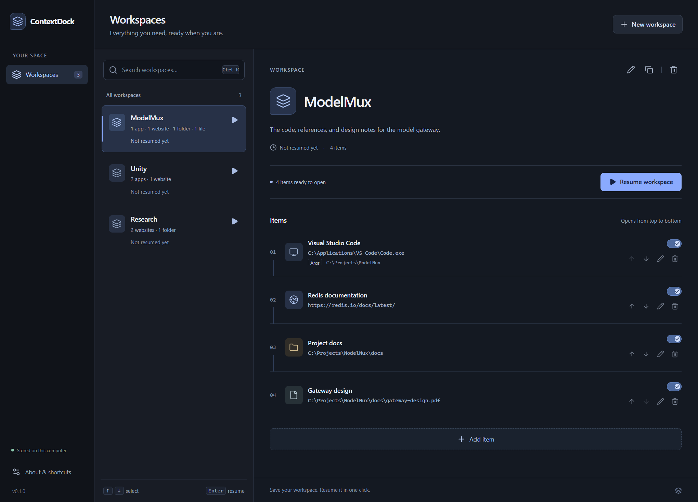

# ContextDock

**Save your workspace. Resume it in one click.**

ContextDock is a local Windows desktop app for bookmarking a working environment:
applications, files, folders, project directories, and websites. Save the resources
for a project once, then search for its workspace and press **Resume** to reopen them.

Built with Electron, React, TypeScript, Vite, and SQLite. The desktop, CLI, and local
MCP server share one workspace service and one database. No account, cloud backend,
AI features, or activity tracking.



<!-- Screenshot source: docs/screenshots/workspace.png -->

## Features

- Create, rename, describe, duplicate, delete, and search workspaces; see when each was last used.
- Add applications, files, folders, and HTTP/HTTPS URLs. Native Windows pickers select local targets.
- Edit item names and targets, supply application arguments, enable or disable items, and reorder launches.
- Resume enabled items in order: URLs in your default browser, files in their associated app, folders in Explorer, and `.exe` applications with separate arguments.
- Review a result for every attempted launch. A missing target or other failure does not prevent later items from opening.
- Open the app with **Ctrl+Alt+Space**, or **Ctrl+Shift+Space** if the first shortcut is unavailable. Inside the app, **Ctrl+K**, type, and **Enter** resumes the selected result.
- Close the window to keep ContextDock available in the tray. Use the tray's **Quit ContextDock** command to exit.
- Keep workspaces in local SQLite with versioned schema migrations; access them through the desktop, CLI, or six MCP tools.

## Install and use

Download a Windows x64 build from [GitHub Releases](https://github.com/tonghzhang/ContextDock/releases):

- **`ContextDock-Setup-0.1.0-x64.exe`** installs the app, shortcuts, CLI, and MCP wrappers. No separate Node.js installation is needed.
- **`ContextDock-Portable-0.1.0-x64.exe`** runs the desktop app without installation. It uses the same local data directory as the installed app; data is not stored beside the portable executable.

Target platforms: **Windows 10 and Windows 11, x64**. This release is unsigned;
Windows may show an unknown-publisher or SmartScreen warning. Verify that you
downloaded it from this repository's release page before proceeding.

1. Launch ContextDock and create a workspace.
2. Choose **Add Item**, select its type, and browse for a local target or enter a URL.
3. For an application, add arguments individually if needed. Arrange the item order.
4. Click **Resume Workspace**, or return to the workspace list, search, and press **Enter**.

A successful result means Windows accepted the launch request. ContextDock does not
wait for websites to load or applications to become ready. It reopens resources;
it does not restore document pages, editor cursors, or window positions.

## Local data

All three interfaces use `%LOCALAPPDATA%\ContextDock\contextdock.sqlite` by default.
Development mode uses this same location. Workspace data stays on your computer;
opening a bookmarked website naturally connects to that website.

Set `CONTEXTDOCK_DATA_DIR` to an **absolute directory path** for an isolated profile.
Use the same value in each desktop, CLI, and MCP process that should share that profile:

```powershell
$env:CONTEXTDOCK_DATA_DIR = Join-Path $PWD "work\my-profile"
npm run dev
```

CLI and MCP also accept `--data-dir <absolute-directory>`. To back up data, quit the
desktop and stop CLI/MCP processes, then copy the entire data directory. Removing a
workspace or item deletes its bookmark records, never the referenced files.

## Development

Install **Node.js 24 or newer** and Git on Windows, then:

```powershell
git clone https://github.com/tonghzhang/ContextDock.git
cd ContextDock
npm ci
npm run dev
```

The renderer supports live updates. Restart `npm run dev` after changing the desktop
process, preload, or core service. The app requires no API keys or external services.

```powershell
npm run lint
npm run format:check
npm run typecheck
npm test
npm run build
npm start
```

`npm run verify` runs lint, type checking, tests, and the production build.
`npm run format` formats source files. Tests cover the workspace service, migrations,
launcher, CLI, and MCP protocol with isolated local databases and controlled launchers.
The Windows CI workflow runs the static checks, tests, and production build.

Run the desktop smoke test on Windows after building:

```powershell
npm run test:e2e
```

It uses an isolated profile under `work/` and checks desktop editing, ordered partial
Resume, shortcuts, restart persistence, and shared CLI/MCP data. Native picker results
are supplied deterministically. Set `CONTEXTDOCK_E2E_DEV=1` to test against the Vite
server, or `CONTEXTDOCK_E2E_EXE` to the absolute path of the unpacked release executable
to test the packaged runtime.

## Build Windows releases

```powershell
npm run dist
```

Run this on Windows to produce an installer and portable executable in `release/`.
The desktop bundle is generated in `dist/`; `npm start` runs that production build.
The installed app includes its runtime, so desktop, CLI, and MCP operation does not
require a separate Node.js installation. Building from source does require Node.js.

## CLI

In the app's installation directory, use the bundled wrapper:

```powershell
.\contextdock.cmd list
.\contextdock.cmd open "ModelMux"
```

Add that directory to your user `PATH` to invoke `contextdock` from any terminal.
For a source checkout, run `npm run build`, then `npm run cli -- <command>`; optionally
run `npm link` to make the same `contextdock` command available.

```powershell
contextdock create "ModelMux" --description "Gateway development"
contextdock add-url "ModelMux" "https://redis.io" --name "Redis documentation"
contextdock add-file "ModelMux" "C:\Documents\gateway.pdf"
contextdock add-folder "ModelMux" "C:\Projects\ModelMux"
contextdock add-app "ModelMux" "C:\Applications\Editor\editor.exe" --arg "C:\Projects\ModelMux"
contextdock list
contextdock show "ModelMux"
contextdock open "ModelMux"
```

Paths in examples are illustrative; substitute existing paths on your computer.
Use `--arg=--new-window` to pass an application flag and repeat `--arg` for separate
arguments. Workspace selectors accept IDs or case-insensitive names. `--json`
provides machine-readable output; a partial launch failure returns the complete
report and exit code `1`. See [all CLI commands and options](docs/cli.md).

## MCP

Configure a trusted MCP client to start ContextDock as a local **stdio** server.
With the installed app, no external Node.js is needed. Replace the illustrative
installation paths in this configuration with your own:

```json
{
  "mcpServers": {
    "contextdock": {
      "command": "C:/Applications/ContextDock/ContextDock.exe",
      "args": ["C:/Applications/ContextDock/resources/cli/mcp.cjs"],
      "env": { "ELECTRON_RUN_AS_NODE": "1" }
    }
  }
}
```

For a source checkout after `npm run build`, use this entry instead:

```json
{
  "mcpServers": {
    "contextdock": {
      "command": "node",
      "args": ["C:/Projects/ContextDock/dist/mcp.cjs"]
    }
  }
}
```

Paths with spaces are supported as single JSON values; do not insert shell quoting
inside them. Do not use `npm` as the MCP command, because its output can interfere
with the stdio protocol. The installed `contextdock-mcp.cmd` wrapper is also provided
for terminal use.

Available tools: `list_workspaces`, `get_workspace`, `open_workspace`,
`create_workspace`, `add_workspace_item`, and `remove_workspace_item`.
A connected client can edit saved workspaces and launch their configured local
applications; ask the user before resuming a workspace. See [tool schemas, results,
and profile configuration](docs/mcp.md).

## Project structure

```text
src/
  core/        Workspace service, validation, SQLite migrations, Windows launcher
  shared/      Types shared by all interfaces
  desktop/     Electron main process, native dialogs, tray, secure preload bridge
  renderer/    React workspace list and editor
  cli/         Command parsing and terminal presentation
  mcp/         MCP schemas, adapter, and stdio entry point
tests/         Core, launcher, CLI, and MCP tests
scripts/       Development, production build, and smoke-test tooling
resources/     App icons and installed command wrappers
docs/          Interface guides, screenshots, and release notes
```

```text
Desktop UI ─┐
CLI ────────┼── Workspace Service ── SQLite / Windows Launcher
MCP Server ─┘
```

Business rules live in the service, not React components or transport handlers.
The renderer uses a narrow IPC bridge; it has no direct Node.js or database access.

## Roadmap

- Capture Current Workspace
- Browser Extension
- Window Layout Restore
- Workspace Version History
- Agent Integration
- Cross-device Sync

These are future directions, not features included in v0.1.0. The current release
focuses on reliable manual bookmarks and one-click Resume.

## License

[MIT](LICENSE)
